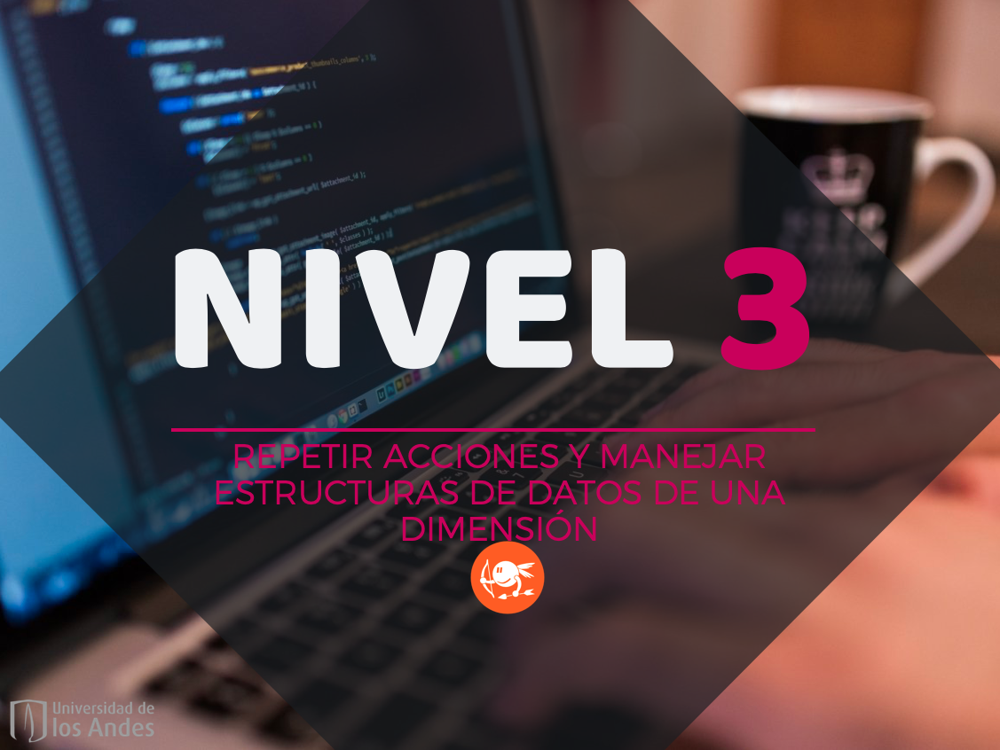

Versión borrador / preliminar |
-------------------|
Este documento es una versión preliminar para uso interno. Si encuentra algún problema o error, o si tiene algún comentario por favor repórtelo a los autores|

# Nivel 3: Repetir acciones

> Éramos de provincia y ahora somos intergaláticos.
> 
> I. Capasso

En este nivel se presentan los conceptos necesarios para que un conjunto de instrucciones se ejecute varias veces dependiendo de alguna condición o de los datos que proporcione el usuario. Aunque suena simple, esto hace que nuestros programas sean infinitamente más poderosos y que sea posible resolver problemas que antes eran imposibles.

El poder adicional que nos dan las instrucciones repetitivas (o iterativas) que estudiaremos en este nivel viene de la mano con una mayor complejidad en los programas que vamos a construir. Es por esto que en este nivel usted debe redoblar sus esfuerzos y recordar lo que dijimos en la introducción al libro: para aprender a programar, se debe practicar programando. Además, la práctica debe ser deliberada y reflexiva: resuelta ejercicios diferentes y al terminar con cada uno reflexione sobre lo que aprendió y sobre lo que se le dificultó.

Los conceptos principales que se estudian en este nivel son los siguientes:

* Instrucciones repetitivas (ciclos)
* Estructuras de datos de una dimensión (listas)
* Recorrido de secuencias (listas y cadenas de caracteres)
* Algorítmica
* Archivos de texto

